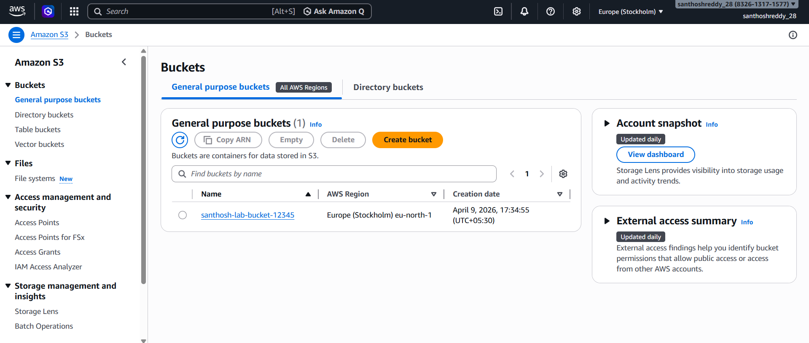
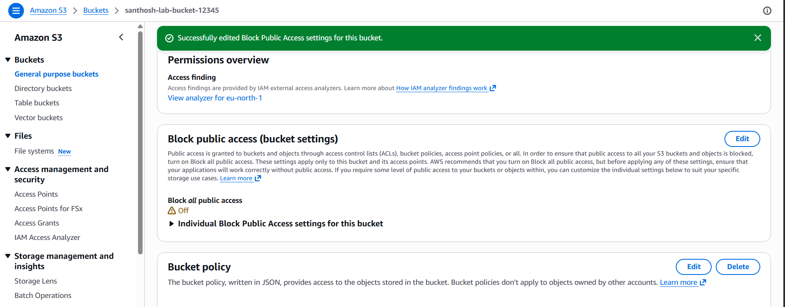
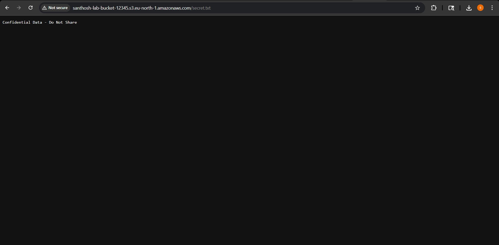
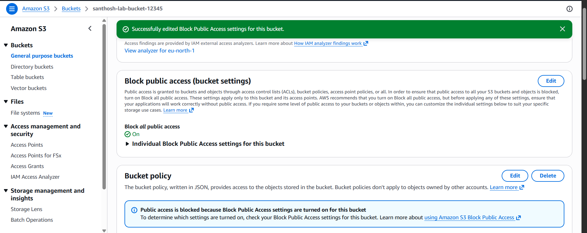
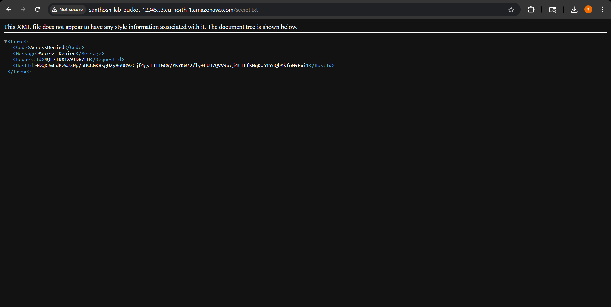

# 🔐 AWS Cloud Security Lab

## 📌 Overview

This project demonstrates a real-world AWS cloud security vulnerability involving **S3 misconfiguration**, leading to **unauthorized data exposure**, followed by proper remediation using secure configurations.

---

## 🎯 Objectives

* Identify misconfigured S3 bucket
* Exploit public data exposure
* Implement secure remediation
* Understand AWS security best practices

---

## 🛠️ Technologies Used

* AWS EC2
* AWS S3
* AWS IAM
* AWS CLI
* Linux (Ubuntu)

---

# 💣 S3 Misconfiguration Attack

## ⚠️ Step 1: Bucket Creation

S3 bucket was created to simulate a storage environment.

---

## 🚨 Step 2: Misconfiguration (Public Access Enabled)

Block Public Access settings were disabled, making the bucket vulnerable.

---

## 💥 Step 3: Data Exposure (Exploit)

Sensitive file was publicly accessible via S3 URL without authentication.

---

## 🔐 Step 4: Remediation (Fix Applied)

Public access restrictions were re-enabled to secure the bucket.

---

## ✅ Step 5: Verification

After applying security controls, access to the file was denied.

---

# 🧠 Key Learnings

* Misconfigured S3 buckets can lead to **critical data leaks**
* AWS **Block Public Access** is a key security control
* Bucket policies can introduce vulnerabilities if misused
* Always follow the **principle of least privilege**
* Defense-in-depth is essential in cloud security

---

# 🔐 Security Best Practices

* Enable **Block Public Access** for all S3 buckets
* Avoid public bucket policies unless absolutely necessary
* Use IAM roles instead of long-term credentials
* Regularly audit cloud configurations
* Enable logging and monitoring (CloudTrail)

---

# 📊 Outcome

Successfully:

* Identified S3 misconfiguration
* Exploited public data exposure
* Implemented remediation
* Verified secure configuration

---

# ⚠️ Disclaimer

This project was conducted in a controlled lab environment for educational purposes only.
